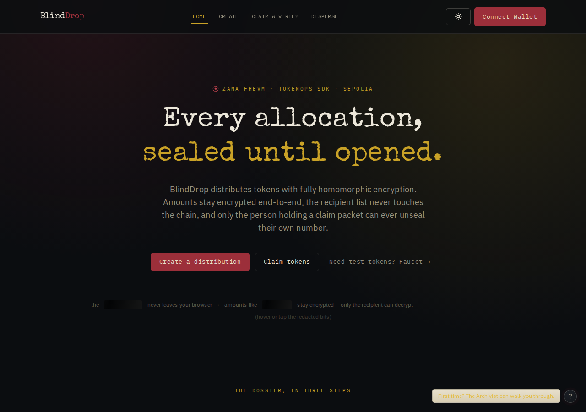
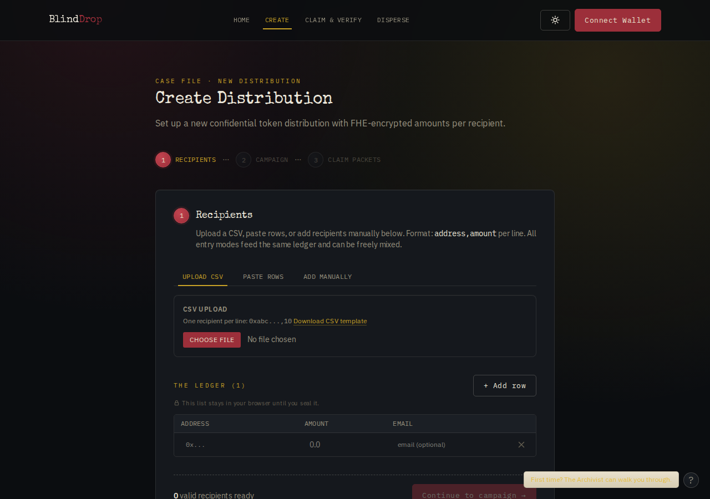
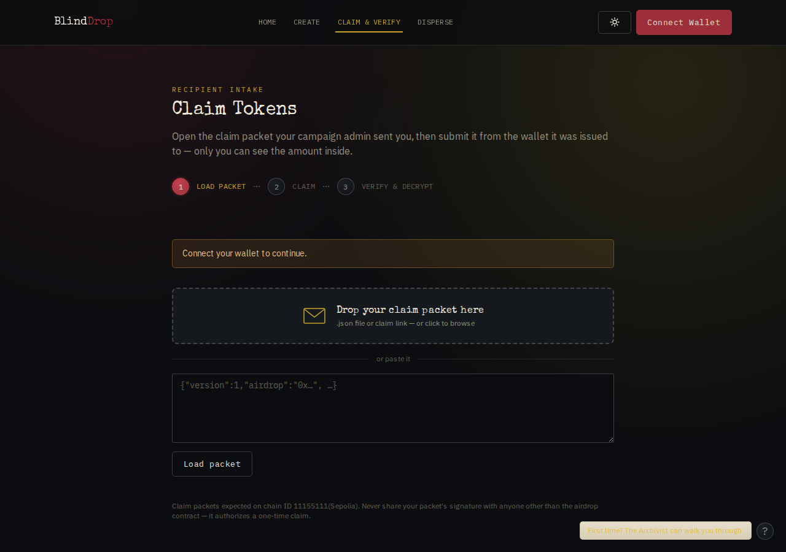

# BlindDrop — Confidential Token Distribution

**Zama Developer Program Mainnet Season 3 — Special Bounty × TokenOps** submission.

BlindDrop distributes tokens with fully homomorphic encryption on the Zama Protocol (Sepolia),
built on the [TokenOps SDK](https://www.npmjs.com/package/@tokenops/sdk). Allocation amounts are
FHE-encrypted end-to-end (ERC-7984), the recipient list never touches the chain, and every
recipient can verify and decrypt **their own** allocation — no one else can, not even the
distribution admin.



<p align="center">
  
  
</p>

## The 5-minute judge journey

1. **Home → "Get test tokens"** — mint the CTTT confidential test token to your wallet.
2. **Create** — add recipients (CSV upload, paste, or type them in; header aliases like
   `wallet_address`/`usdc_amount` work; optional email column) → deploy a campaign → approve +
   fund → the app encrypts each allocation client-side, in parallel, and **seals a claim packet
   per recipient**. Name the campaign (stored only in your browser) and save it to the on-chain
   registry so it survives reloads.
3. **Deliver** — each recipient gets their personal **claim link** however you like: one-toggle
   email auto-send (via EmailJS, still no backend), a pre-filled mail draft, the native share
   sheet on mobile, copy-all links, or plain JSON files. Track who has claimed from the same
   screen, and download a full campaign report (CSV/JSON).
4. **Claim & Verify** — as a recipient, open your claim link (packet pre-loaded), **reveal your
   exact allocation** before or after claiming, claim, then decrypt your balance — all reveals
   happen in your browser via Zama's EIP-712 user decryption.
5. **Disperse** — the push model: pay any list in **one transaction**, no claiming, no packets —
   for payroll and investor payouts at scale.

## What stays confidential

| | On-chain | Who can see it |
|---|---|---|
| Allocation amounts | FHE ciphertext (`euint64`) | Only the owning recipient (EIP-712 user decryption) |
| Recipient list | Never on-chain | Only the admin's browser and each individual recipient |
| Balances | Ciphertext handles | Only the balance owner |
| Campaign names | Never on-chain (browser-local) | Only the admin |

Precise boundary — including what is *not* hidden (claim-tx senders self-reveal, ERC-7984 event
addresses) — in [docs/THREAT_MODEL.md](docs/THREAT_MODEL.md). Limits are stated exactly; nothing
is overclaimed. There is deliberately **no public eligibility checker**: any "connect and check"
surface would let outsiders test who is on a list.

## Architecture

- **No backend.** Pure client-side Next.js app: browser → wallet → Sepolia, browser → Zama
  relayer. The recipient list and plaintext amounts never leave the admin's browser. Optional
  email delivery goes browser → EmailJS (a mail provider, like sending from your own mailbox) —
  never through any BlindDrop server, because none exists.
- **Distribution contracts: TokenOps' audited ones.** All token movement runs on TokenOps'
  pre-deployed, [OpenZeppelin-audited](https://www.openzeppelin.com/news/tokenops-zama-confidential-airdrop-audit)
  contracts (`fhe-airdrop` factory clones, `fhe-disperse` singleton), driven exclusively through
  `@tokenops/sdk`.
- **One first-party contract:** [`contracts/BlindDropRegistry.sol`](contracts/) — a minimal,
  permissionless on-chain campaign index (stores only already-public metadata; no funds, no owner,
  no upgrades). Deployed and source-verified on Sepolia at
  [`0xA95082Fa6Cf0c8c7052dEB5b24F00C545740457F`](https://sepolia.etherscan.io/address/0xA95082Fa6Cf0c8c7052dEB5b24F00C545740457F),
  with 24 unit tests.
- **Works with any ERC-7984 token** — registry-backed token picker (including cUSDT), token
  identity verification, and a decrypt-your-balance check before funding.
- **Stack:** Next.js (App Router) · wagmi + viem · `@tokenops/sdk` · `@zama-fhe/sdk` + react-sdk ·
  custom design system ("Confidential Dossier", light + dark), no UI library.

## Quality

- **94 frontend unit tests** (packet validation, CSV parsing incl. precision guards, claim-link
  encoding, report serialization, EmailJS config precedence) + **24 contract tests**.
- CI: lint → typecheck → test → build on every push (`.github/workflows/ci.yml`).
- Every page verified overflow-free at 360/375/414 px; WCAG-AA-checked palettes in both themes;
  `prefers-reduced-motion` respected throughout.
- Humanized errors app-wide: plain-language headline + action, raw details in a collapsible
  disclosure.

## Run it

```bash
cd app
npm ci
npm run dev        # http://localhost:3000
```

Optional env (all `NEXT_PUBLIC_*`, client-side by design): `NEXT_PUBLIC_RPC_URL` (Sepolia RPC;
falls back to a public endpoint), `NEXT_PUBLIC_EMAILJS_SERVICE_ID` / `_TEMPLATE_ID` /
`_PUBLIC_KEY` (enables one-click email delivery via your EmailJS account). You need a browser
wallet on Sepolia with a little ETH for gas; test tokens come from the Home page faucet.

Contracts: `cd contracts && npm ci && npx hardhat test` (see [contracts/README.md](contracts/README.md)).

## Scale & roadmap

- **Large lists:** use Disperse — one transaction for any list size. Claim campaigns sign one
  authorization per recipient by design (each must be admin-signed; the audited contract verifies
  the signer's role at claim time), so browser-wallet signing is per-recipient. For huge
  signature-based drops, the production path is programmatic signing with a secured key — the SDK
  supports it server-side; not shipped here by choice.
- Roadmap: wallet-native packet delivery (XMTP), in-app ERC-20 → ERC-7984 wrapping, bulk-sign CLI.

## Docs

- [docs/BOUNTY_COMPLIANCE.md](docs/BOUNTY_COMPLIANCE.md) — official bounty requirements, one by one
- [docs/THREAT_MODEL.md](docs/THREAT_MODEL.md) — exact confidentiality boundary & trust assumptions
- [docs/SECURITY.md](docs/SECURITY.md) — security posture & audit lineage
- [docs/SUBMISSION_KIT.md](docs/SUBMISSION_KIT.md) — demo video script & X thread
